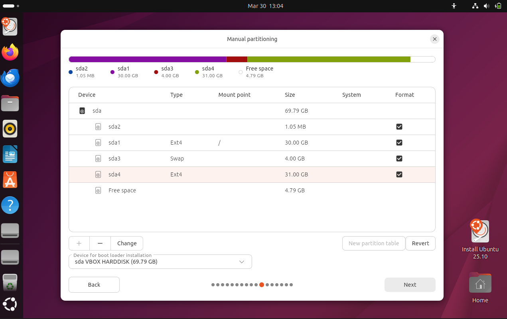
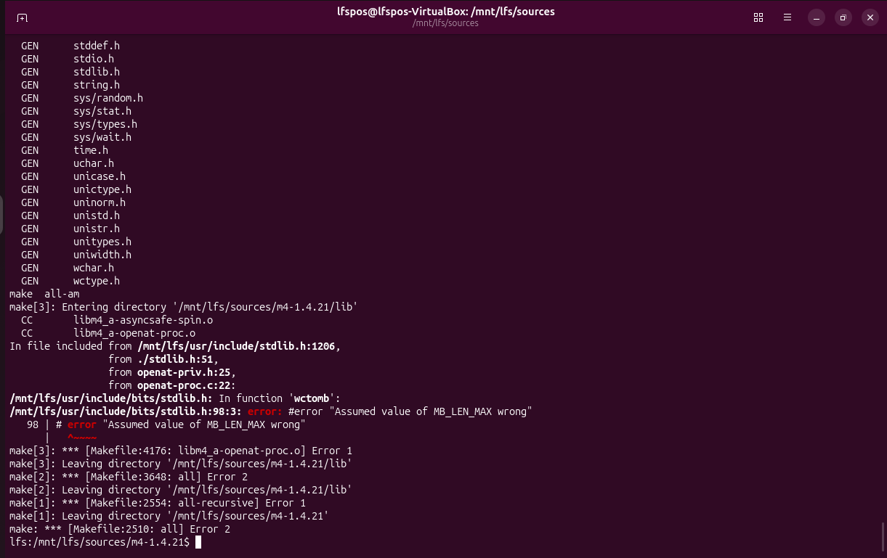
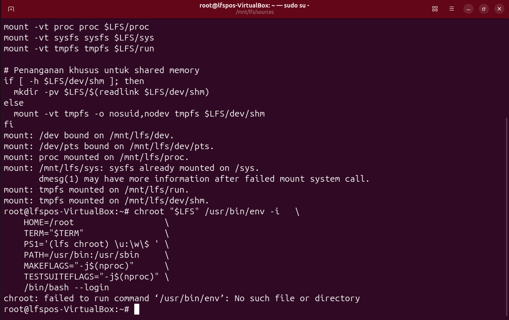
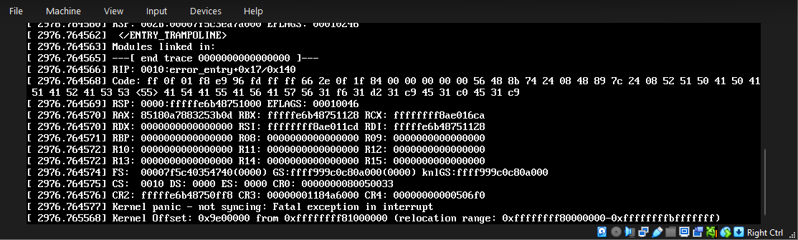
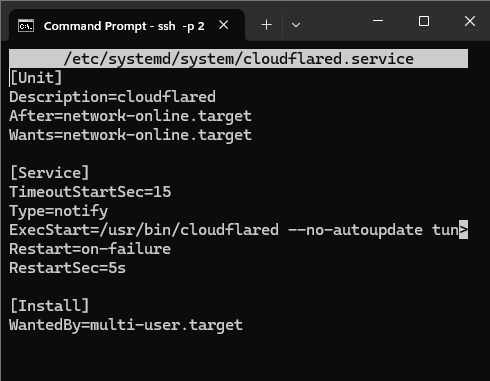

# Build Guide - Teknik Baik OS

## Warning
* **Bukan Proses *Copy-Paste*:** Membangun *Linux From Scratch* (LFS) bukanlah prosedur otomatis. Skrip dan perintah di dalam repositori ini mungkin tidak akan berjalan sempurna di sistem Anda tanpa penyesuaian. Faktor seperti lingkungan *host*, arsitektur perangkat keras, dan skema partisi sangat memengaruhi hasil kompilasi.
* **Kompleksitas Sistem:** Keberhasilan pembangunan OS ini sangat bergantung pada ketelitian tingkat tinggi dalam menangani urutan dependensi *package*, konfigurasi *kernel* kustom, serta pengaturan *toolchain* (*temporary environment*). Kesalahan kecil atau ketidakcocokan versi pada satu tahap awal dapat menyebabkan kegagalan kompilasi (*build failure*) yang fatal pada tahap akhir.
* **Rujukan Utama yang Diwajibkan:** Panduan ini tidak dirancang untuk menggantikan dokumentasi resmi. Untuk pemahaman yang komprehensif, linear, dan aman, kami mewajibkan pembaca dan pengembang untuk menjadikan **LFS Book** resmi sebagai pedoman absolut.

**LFS BOOK PDF:** [https://www.linuxfromscratch.org/lfs/downloads/stable-systemd/LFS-BOOK-13.0-SYSD.pdf](https://www.linuxfromscratch.org/lfs/downloads/stable-systemd/LFS-BOOK-13.0-SYSD.pdf)
**LFS FAQ:** [https://www.linuxfromscratch.org/lfs/faq.html](https://www.linuxfromscratch.org/lfs/faq.html)

## System Requirements
* **Host OS:** Ubuntu 25.10 
* **RAM:** 6GB minimum, 8GB+ recommended
* **Disk:** 65GB free space
* **CPU:** 2 cores minimum, 4 cores recommended
* **Video Memory:** 128MB is sufficient
* **

## Preparation Steps (LFS Chapter 2-4)
### 1. Host System Setup
Langkah pertama sebelum membangun Linux From Scratch (LFS) adalah alokasi hardware sistem dan mengonfigurasi sistem *host*  agar memiliki lingkungan yang terisolasi dan *tools* kompilasi yang memadai.

- **Alokasikan RAM, Disk, Cpu, Video Memory Sesuai Kebutuhan**

- **Persiapan Packages Host:** Pastikan *host* OS sudah memiliki *compiler* dan utilitas dasar yang diwajibkan oleh LFS. Eksekusi perintah berikut di terminal host:

  ```bash
  sudo apt update
  sudo apt install build-essential bison gawk texinfo m4 python3 wget curl -y
  ```

- **Konfigurasi Environment Variable ($LFS):** Kita wajib mendefinisikan variabel `$LFS` yang menunjuk ke *mount point* partisi LFS kita agar perintah selanjutnya tidak salah target ke sistem host.

```bash
  sudo su -

  export LFS=/mnt/lfs

  mount -v -t ext4 /dev/sda4 $LFS
  mount -v --bind /dev $LFS/dev
  mount -vt devpts devpts -o gid=5,mode=0620 $LFS/dev/pts
  mount -vt proc proc $LFS/proc
  mount -vt sysfs sysfs $LFS/sys
  mount -vt tmpfs tmpfs $LFS/run

  if [ -h $LFS/dev/shm ]; then
    install -v -d -m 1777 $LFS$(realpath /dev/shm)
  else
    mount -vt tmpfs -o nosuid,nodev tmpfs $LFS/dev/shm
  fi

  chroot "$LFS" /usr/bin/env -i   \
      HOME=/root                  \
      TERM="$TERM"                \
      PS1='(lfs chroot) \u:\w\$ ' \
      PATH=/usr/bin:/usr/sbin     \
      MAKEFLAGS="-j$(nproc)"      \
      TESTSUITEFLAGS="-j$(nproc)" \
      /bin/bash --login
    ```

- **Pembuatan User LFS Terisolasi:** Untuk mencegah *error* kompilasi yang merusak OS host, kita membuat *user* khusus bernama `lfs` tanpa akses `root`. Seluruh proses pembuatan *cross-compiler* sementara akan dilakukan oleh *user* ini.

  ```bash
  groupadd lfs
  useradd -s /bin/bash -g lfs -m -k /dev/null lfs
  passwd lfs
  ```

### 2. Partition Preparation

- **sda 1 untuk host system (30GB)**
- **sda 3 untuk swap (4-5GB)**
- **sda 4 untuk lfs system (30GB)**

### 3. Download Sources with Wget
Sistem LFS dibangun murni dari *source code* mentah. Semua *tarball* (paket aplikasi) dan *patches* harus dikumpulkan di dalam satu direktori yaitu `$LFS/sources`.

- **Pembuatan Direktori Sources:**
  Buat folder dan berikan hak akses agar bisa ditulis dan diakses secara global.

  ```bash
  mkdir -v $LFS/sources
  chmod -v a+wt $LFS/sources
  ```

- **Mengunduh Wget-List & Seluruh Paket LFS:**
   kita mengambil daftar tautan resmi (`wget-list`) lalu mengunduh semua daftar package yang dibutuhkan. Perintah `-c` (continue) digunakan agar unduhan yang gagal bisa dilanjutkan tanpa mengulang dari awal.

  ```bash
  # 1. Unduh daftar lengkap link source code LFS
  wget [https://www.linuxfromscratch.org/lfs/view/stable/wget-list](https://www.linuxfromscratch.org/lfs/view/stable/wget-list) -O $LFS/sources/wget-list
  
  # 2. Eksekusi pengunduhan massal seluruh paket LFS
  wget --input-file=$LFS/sources/wget-list --continue --directory-prefix=$LFS/sources
  ```

## Build Process

### Phase 1 (LFS Chapter 5-6): Toolchain & Temporary Tools
Fase ini dilakukan di lingkungan *Host* (Ubuntu) dengan *user* `lfs` untuk membangun *compiler* silang (*cross-compiler*) dan alat-alat dasar sementara. 

**Catatan Implementasi:**
Seluruh langkah kompilasi pada fase ini merujuk pada pedoman resmi *Linux From Scratch Book*. Untuk efisiensi, dokumentasi *command lengkap*, dan kemudahan reproduksi sistem, kami telah merangkum seluruh perintah Phase 1 ke dalam skrip bash.
* **Lihat Script:** [scripts/02-build-toolchain.sh](scripts/02-build-toolchain.sh)
* **Entering Chroot & Building Additional Tools:** [scripts/03-chroot-preparation.sh](scripts/03-chroot-preparation.sh)

### Phase 2 (LFS Chapter 7-11): System Base 
Fase ini adalah membangun sistem operasi murni dari dalam lingkungan isolasi (Chroot). Sama halnya dengan Phase 1, perintah kompilasi untuk *Essential Packages* (seperti Coreutils, Bash, dll) kami rangkum dalam skrip otomatisasi. **Peringatan!** script build-system ini tidak lengkap tolong tetap berpandu pada lfs book untuk melihat script apa yang perlu dijalankan.
* **Lihat Script:** [scripts/04-build-system.sh](scripts/04-build-system.sh)

**Khusus Kompilasi Kernel:**
Kami melakukan penyesuaian konfigurasi kernel agar OS ini optimal sebagai *Web Server*.
*   **Command:** `make menuconfig` lalu `make && make modules_install`
*   **Optimasi:** Mengaktifkan dukungan jaringan (Networking), File System (Ext4), dan driver SATA/AHCI menjadi *Built-in* (`[*]`), bukan Modul (`[M]`), agar *server* dapat *booting* mandiri tanpa *initramfs*.
*   **Konfigurasi Dasar:** [configs/kernel.configl](configs/kernel.config)

### Phase 3 (BLFS): Theme-Specific (Server OS)
Fase ini adalah implementasi sistem operasi khusus untuk menjalankan *production web server*. Berikut adalah perintah spesifik yang kami eksekusi di dalam LFS:

**1. Nginx (Web Server) - Compiled from Source**
Kompilasi Nginx dari *source code* untuk menjalankan antarmuka web POS.
```bash
wget [http://nginx.org/download/nginx-1.24.0.tar.gz](http://nginx.org/download/nginx-1.30.0.tar.gz)
tar -xvf nginx-1.30.0.tar.gz
cd nginx-1.30.0
./configure --prefix=/usr --user=nginx --group=nginx --with-http_ssl_module
make
make install
```

**2. PHP-FPM - Compiled from Source**
Mengkompilasi PHP.
```bash
wget [https://www.php.net/distributions/php-8.2.10.tar.gz](https://www.php.net/distributions/php-8.5.3.tar.gz)
tar -xvf php-8.5.3.tar.gz
cd php-8.5.3
./configure --prefix=/usr                \
            --sysconfdir=/etc            \
            --localstatedir=/var         \
            --datadir=/usr/share/php     \
            --mandir=/usr/share/man      \
            --enable-fpm                 \
            --without-pear               \
            --with-fpm-user=apache       \
            --with-fpm-group=apache      \
            --with-fpm-systemd           \
            --with-config-file-path=/etc \
            --with-zlib                  \
            --enable-bcmath              \
            --with-bz2                   \
            --enable-calendar            \
            --enable-dba=shared          \
            --with-gdbm                  \
            --with-gmp                   \
            --enable-ftp                 \
            --with-gettext               \
            --enable-mbstring            \
            --disable-mbregex            \
            --with-readline              &&
make
make install                                     &&
install -v -m644 php.ini-production /etc/php.ini &&

install -v -m755 -d /usr/share/doc/php-8.5.3 &&
install -v -m644    CODING_STANDARDS* EXTENSIONS NEWS README* UPGRADING* \
                    /usr/share/doc/php-8.5.3

if [ -f /etc/php-fpm.conf.default ]; then
  mv -v /etc/php-fpm.conf{.default,} &&
  mv -v /etc/php-fpm.d/www.conf{.default,}
fi
```

**3. MariaDB (Database Server) v11.8.6 - Compiled from Source**
Menginstal MariaDB, serta mengonfigurasi *user/group* khusus demi keamanan *database*. Menggunakan `cmake` untuk proses kompilasinya.
```bash
# a. Membuat user dan group khusus database
groupadd -g 41 mysql
useradd -c "MySQL Server" -d /srv/mariadb -g mysql -s /bin/false -u 41 mysql

sed -i 's/regex system/regex/' \
       storage/columnstore/columnstore/cmake/boost.cmake

# b. Download dan Ekstrak
wget [https://downloads.mariadb.org/interstitial/mariadb-11.8.6/source/mariadb-11.8.6.tar.gz](https://downloads.mariadb.org/interstitial/mariadb-11.8.6/source/mariadb-11.8.6.tar.gz) -O mariadb-11.8.6.tar.gz
tar -xvf mariadb-11.8.6.tar.gz
cd mariadb-11.8.6

# c. Kompilasi menggunakan CMake
mkdir build &&
cd    build &&

cmake -D CMAKE_BUILD_TYPE=Release                       \
      -D CMAKE_INSTALL_PREFIX=/usr                      \
      -D GRN_LOG_PATH=/var/log/groonga.log              \
      -D INSTALL_DOCDIR=share/doc/mariadb-11.8.6        \
      -D INSTALL_DOCREADMEDIR=share/doc/mariadb-11.8.6  \
      -D INSTALL_MANDIR=share/man                       \
      -D INSTALL_MYSQLSHAREDIR=share/mariadb            \
      -D INSTALL_MYSQLTESTDIR=share/mariadb/test        \
      -D INSTALL_PAMDIR=lib/security                    \
      -D INSTALL_PAMDATADIR=/etc/security               \
      -D INSTALL_PLUGINDIR=lib/mariadb/plugin           \
      -D INSTALL_SBINDIR=sbin                           \
      -D INSTALL_SCRIPTDIR=bin                          \
      -D INSTALL_SQLBENCHDIR=share/mariadb/bench        \
      -D INSTALL_SUPPORTFILESDIR=share/mariadb          \
      -D MYSQL_DATADIR=/srv/mariadb                     \
      -D MYSQL_UNIX_ADDR=/run/mariadb/mariadb.sock      \
      -D WITH_EXTRA_CHARSETS=complex                    \
      -D WITH_EMBEDDED_SERVER=ON                        \
      -D SKIP_TESTS=ON                                  \
      -D TOKUDB_OK=0                                    \
      -W no-dev                                         \
      .. &&
make
make install
make install-mariadb

# d. Post-Installation & Hak Akses
mkdir -p /srv/mariadb /etc/mysql
chown -R mysql:mysql /srv/mariadb
mariadb-install-db --user=mysql --basedir=/usr --datadir=/srv/mariadb
```

**4. CloudFlare**
Memasang Cloudflare Tunnel agar *server* lokal LFS dapat diakses secara publik dengan protokol HTTPS 
```bash
wget [https://github.com/cloudflare/cloudflared/releases/latest/download/cloudflared-linux-amd64](https://github.com/cloudflare/cloudflared/releases/latest/download/cloudflared-linux-amd64)
mv cloudflared-linux-amd64 /usr/bin/cloudflared
chmod +x /usr/bin/cloudflared

# Integrasi dengan Systemd
cloudflared service install <TOKEN_DARI_DASHBOARD_CLOUDFLARE>
systemctl start cloudflared
systemctl daemon-reload
```

**5. Systemd Services (Autopilot)**
Mendaftarkan servis Nginx, PHP, MariaDB beserta Cloudflare ke *Systemd* agar OS dapat beroperasi mandiri setiap kali komputer dihidupkan.
```bash
systemctl enable mariadb php-fpm nginx cloudflared
```

## Total Build Time
* **Estimated:** 24 +/- Hours with AMD Ryzen 7 7730U with Radeon Graphics

## Troubleshooting

### Common Errors dan Solusi

* **Error M4 (`#error "Assumed value of MB_LEN_MAX wrong"`):** 

  * **Penyebab:** Terjadi saat fase *make* paket `m4`. Ini disebabkan oleh bentrok header C (glibc) antara sistem *Host* (Ubuntu 25.10) dengan lingkungan sementara LFS, atau *source code* M4 membutuhkan *patch* spesifik untuk versi Glibc yang baru.
  * **Solusi:** Hapus folder ekstrak `m4` yang *error*, ekstrak ulang dari berkas `.tar`, lalu pastikan untuk menjalankan perintah *sed* (manipulasi teks) bawaan dari panduan buku LFS untuk memperbaiki *file* `lib/stdio.in.h` sebelum menjalankan `./configure`. Pastikan juga *environment variable* tidak bocor dari OS Host.

* **Error Chroot (`chroot: failed to run command '/usr/bin/env': No such file or directory`):**

  * **Penyebab:** Perintah gagal dijalankan saat mencoba masuk ke lingkungan *chroot* LFS. Sistem LFS tidak dapat menemukan program `env` di dalam `$LFS/usr/bin`. Ini biasanya terjadi karena pembuatan *symlink* direktori (seperti `/bin` ke `/usr/bin`) terlewat, atau kompilasi paket `coreutils` di fase *Temporary Tools* sebelumnya gagal/dilewati.
  * **Solusi:** Keluar dari *chroot*, periksa kembali direktori `$LFS/usr/bin`. Jika kosong, ulangi kompilasi paket `coreutils` pada fase *Cross Compiling Temporary Tools*, dan pastikan perintah pembuatan *symlink* awal dieksekusi dengan benar sebelum mencoba masuk *chroot* kembali.

* **Kernel Panic / Crash Saat Kompilasi (Out of Memory):** 

  * **Penyebab:** Terjadi *crash* atau *Kernel Panic* secara tiba-tiba di tengah proses kompilasi paket berat seperti **PHP** dan **GCC**. Penyebab utamanya adalah kehabisan memori RAM (Out of Memory). Alokasi RAM untuk VirtualBox berada di batas minimum (6GB), sementara di sistem operasi *Host* (Windows) terdapat terlalu banyak *tab browser* dan aplikasi tidak penting yang terbuka. Hal ini menyebabkan bentrokan *resource* RAM, sehingga Kernel LFS mati mendadak.
  * **Solusi:** Matikan paksa (Power Off) VirtualBox. Sebelum menyalakan dan mengulangi kompilasi, tutup semua *browser* dan aplikasi berat di *Host* Windows untuk mengurangi penggunaan RAM Lalu Kompilasi Ulang Lagi. 

* **Cloudflare Systemd Timeout (`Job for cloudflared.service failed because a timeout was exceeded`):** 
        `
  * **Penyebab:** *Systemd* di LFS mencoba mematikan paksa `cloudflared` karena *service* tersebut diatur dengan `Type=notify`. Cloudflare gagal mengirimkan sinyal "active" kembali ke *Systemd*, sehingga dianggap *hang*.
  * **Solusi:** Edit file `/etc/systemd/system/cloudflared.service`. Ubah baris `Type=notify` menjadi `Type=simple`. Reload *Systemd* dengan perintah `systemctl daemon-reload`, lalu nyalakan ulang layanan cloudflarenya dengan `systemctl start cloudflared`.

### Verification Steps
* **Cek Kernel:** Jalankan perintah `uname -a` untuk memastikan sistem berjalan menggunakan Kernel LFS hasil kompilasi mandiri.
* **Cek Web Server:** Jalankan `systemctl status nginx`, `systemctl status mariadb` dan `systemctl status php-fpm`. Ketiganya harus berstatus `active (running)`.
* **Cek Tunnel:** Akses URL *website* dari HP atau perangkat lain. Jika halaman *login* POS terbuka tanpa *error* 500, maka *database* dan *web server* sudah terintegrasi sempurna.