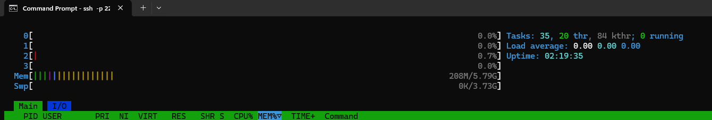

# System Documentation - TeknikBaik OS

## Arsitektur Sistem Overview
Sistem operasi TeknikBaik OS dibangun dari *source code* murni secara mandiri (berbasis Linux From Scratch). Arsitektur utamanya didesain *headless* (tanpa *Graphical User Interface*) untuk memaksimalkan stabilitas dan efisiensi *resource hardware*. Sistem ini difokuskan secara khusus untuk menjadi *Server OS* yang menjalankan aplikasi Point of Sales (POS). Manajemen servis dikendalikan sepenuhnya oleh **Systemd**, memastikan seluruh tumpukan aplikasi web (Nginx, PHP, MariaDB, dan CloudFlare) berjalan secara *autopilot* sejak komputer dinyalakan.

## Package List 
Daftar lengkap perangkat lunak (*packages*) beserta versinya dapat dilihat pada tautan berikut: 
[package-list.txt](./packages/package-list.txt)

## Kernel Configuration Choices
Kami menggunakan perintah `make defconfig` sebagai dasar (konfigurasi optimal bawaan arsitektur sistem), kemudian melakukan penyesuaian khusus:
* **Systemd Requirements:** Sesuai pedoman LFS, kami mengaktifkan fitur krusial agar Systemd dapat bekerja, seperti `CGROUPS` (untuk manajemen servis), `DEVTMPFS` (automount filesystem), dan `INOTIFY_USER`.
* **Server Optimization:** Kami mengatur *driver* File System (Ext4) dan SATA/AHCI menjadi *Built-in* (`[*]`) agar *server* dapat *booting* cepat tanpa *initramfs*.
* **Networking:** Mengaktifkan dukungan TCP/IP dan IPv6 secara penuh untuk keperluan *web server* dan *tunneling*.

## File System Layout
Sistem operasi ini mengikuti standar Filesystem Hierarchy Standard (FHS):
* `/boot`: Menyimpan Linux Kernel dan file konfigurasi GRUB.
* `/etc`: Menyimpan file konfigurasi sistem dan aplikasi (seperti `/etc/nginx` dan `/etc/mysql`).
* `/srv`: Menyimpan data spesifik layanan (misal: `/srv/mariadb` untuk *database*, `/srv/www` untuk *file* web POS).
* `/usr`: Menyimpan mayoritas *binary executable* aplikasi dan *library*.
* `/var`: Menyimpan *log* sistem dan *spool files*.

## Init System Setup
* Menggunakan **Systemd**.
* Service yang di-enable (Otomatis berjalan saat *boot*): `nginx.service`, `php-fpm.service`, `mariadb.service`, `cloudflared.service`.

## Network Configuration
* **Local Network:** Menggunakan IP dinamis (DHCP) yang dikelola oleh `systemd-networkd`.
* **Public Access:** Tidak menggunakan *Port Forwarding* konvensional. Kami menggunakan **Cloudflare Zero Trust Tunnel** (`cloudflared`) untuk merutekan trafik lokal ke domain publik secara aman dengan enkripsi SSL/TLS.

## User & Permissions
Untuk menjaga keamanan, layanan tidak dijalankan menggunakan akses *root*:
* `root`: Superuser (Hanya untuk administrasi sistem inti).
* `nginx`: Menjalankan *web server* Nginx dan PHP-FPM.
* `mariadb`: *User* khusus tanpa akses *shell* (`/bin/false`) untuk menjalankan MariaDB secara terisolasi.

## Services Yang Running
* **Nginx** (Berjalan pada Port: `80` - TCP)
* **PHP-FPM** (Berjalan pada Port: `9000` - TCP)
* **MariaDB** (Berjalan pada Port: `3306` - TCP)
* **Cloudflared** (Koneksi *Outbound* ke *Edge Network* Cloudflare)

## Security Measures
1. **Minimal Attack Surface:** OS tidak memiliki *packages* berlebih atau GUI, sehingga celah kerentanan sangat.
2. **Isolasi Service:** Nginx dan MariaDB dijalankan oleh *user* *non-root* (`nginx` dan `mysql`).
3. **Zero Trust Tunneling:** *Server* tidak membuka *port inbound* (80/443) ke internet publik. Semua trafik masuk difilter melalui *tunnel* Cloudflare, mencegah serangan DDoS atau pemindaian IP langsung.

## Performance Benchmarks
Berikut adalah penggunaan *resource* saat *server* berjalan secara *idle*:

*(Catatan: Jangan lupa simpan foto htop.png di folder docs/screenshots)*

## Comparison Dengan Distro Mainstream
Berdasarkan pengujian, TeknikBaik OS memiliki keunggulan performa dibandingkan Ubuntu Server atau Debian standar:
* **Ukuran Penyimpanan:** TeknikBaik OS hanya memakan ruang disk sekitar **~2 GB hingga 3 GB**, jauh lebih kecil dibanding Ubuntu Server yang bisa memakan 5 GB+.
* **Penggunaan Memori (RAM):** Saat *idle* dengan *web server* menyala, LFS hanya memakan RAM sekitar **150 MB - 250 MB**, sementara Ubuntu Server biasanya membutuhkan >800 MB.
* **Waktu Booting:** LFS kami mencapai halaman *login* dalam waktu kurang dari **10 detik** karena absennya *bloatware* dan fitur *snap* seperti pada Ubuntu.

---
### Diagrams
*(Silakan buat diagram kotak-kotak sederhana menggunakan website draw.io atau Canva, lalu simpan fotonya di folder `docs/screenshots` dan isi linknya di bawah ini)*
* **Boot Process Flowchart:** [Link ke gambar](./docs/screenshots/boot-process.png)
* **Package Dependency Graph:** [Link ke gambar](./docs/screenshots/dependency.png)
* **System Architecture Diagram:** [Link ke gambar](./docs/screenshots/architecture.png)